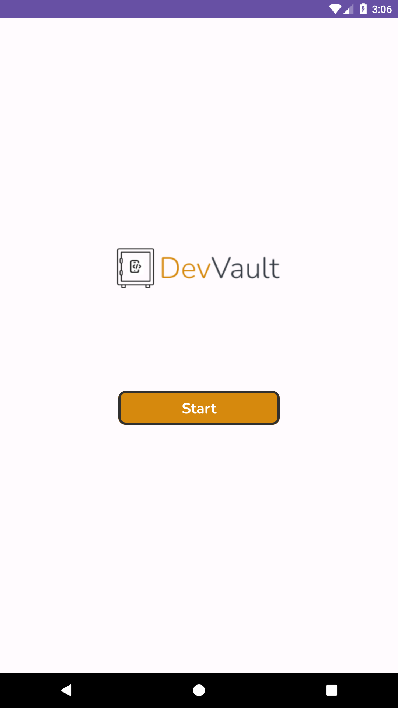
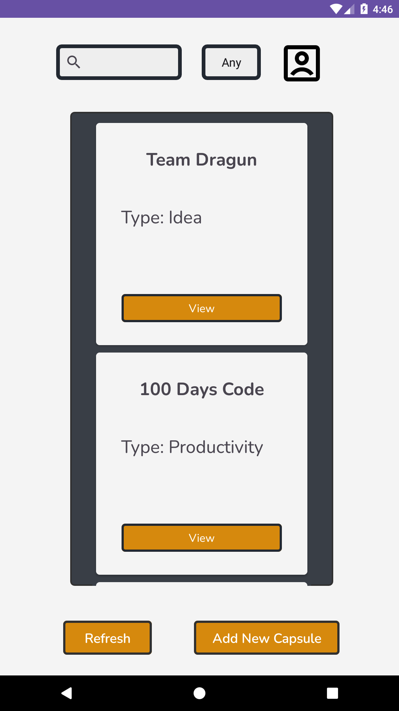
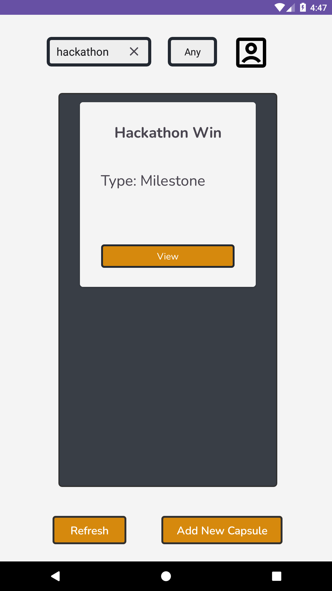
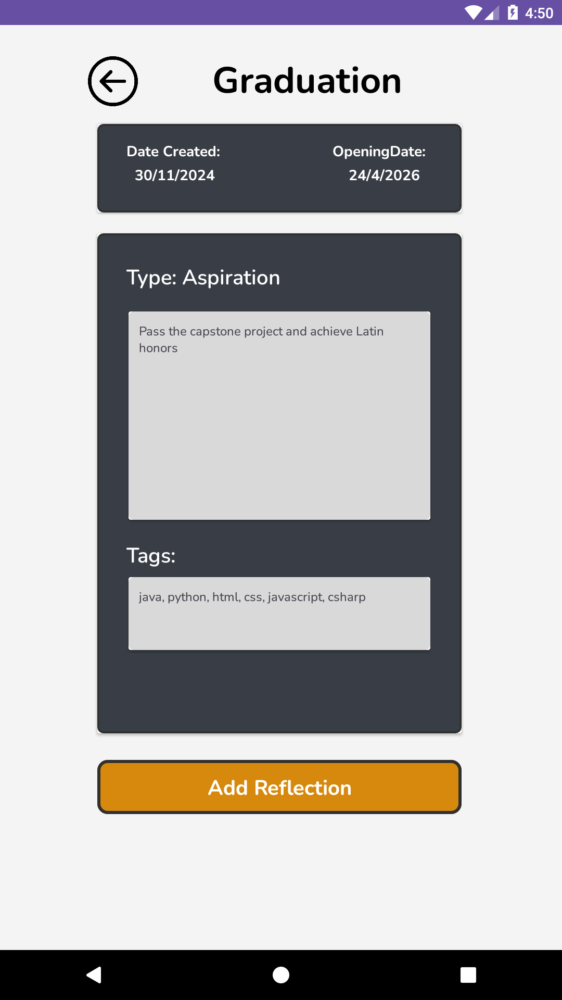
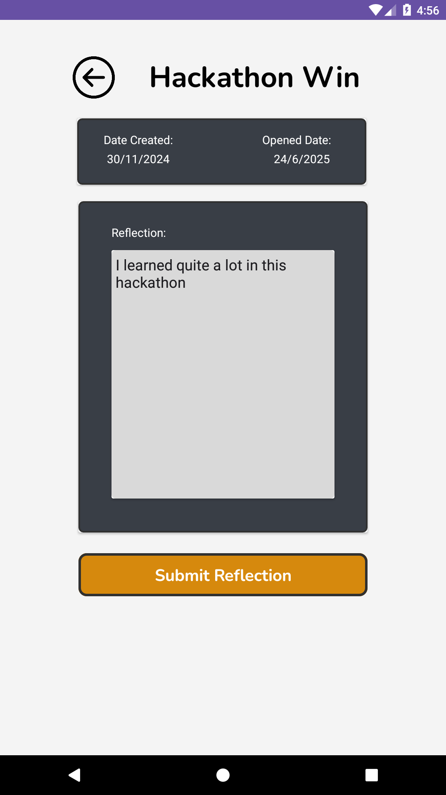
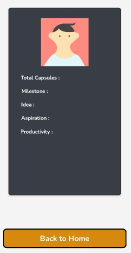

# DevVault : 6-Hour Hackathon Submission

## Description

The ICT Week 2024 App Development Hackathon is hosted by a student organization named [ALPHA](https://alpha-official2024.vercel.app/) in STI College Ortigas-Cainta. The hackathon was held on campus at a computer laboratory on November 28, 2024 with 6 hours of development time. The awarding ceremony took place on November 29, 2024, on campus. It is the date when me and my team were crowned the champions of the hackathon.

_Bottom Note:_ I do apologize for the messy commit messages though. The development time was limited and we had to allocate the majority of our focus on finishing the functionalities of our mobile application.

### Developers

- [Marc Plarisan | DragunWF](https://github.com/DragunWF) - Lead Developer
- [Jay Arnon Sinahunon | JasDevPH](https://github.com/JasDevPH) - Developer, UI/UX Design
- [Isaac Gidan Garcia | n-ginan](https://github.com/n-ginan) - Developer

## Hackathon Theme

The theme is Dev Time Capsule celebrates a developer's journey by creating a personalized digital snapshot that captures their skills, achievements, and aspirations. It challenges participants to build an interactive project where users can "seal" memories or goals for the future and "open" them later to reflect on their growth. This theme blends storytelling and functionality, encouraging participants to showcase their unique identity as developers while demonstrating creativity and technical expertise.

## Images of the App

## Landing Page

    

## Home Page

### Without Filters

    

### With Spinner Filter

    

### With Search Filter

    

## View Capsule Page

    

## Reflection Page

    

## Progress Tracker Page

    

